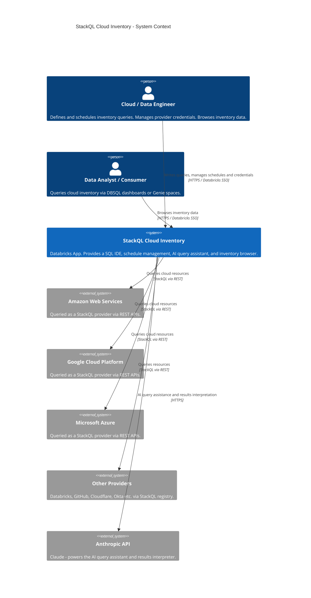
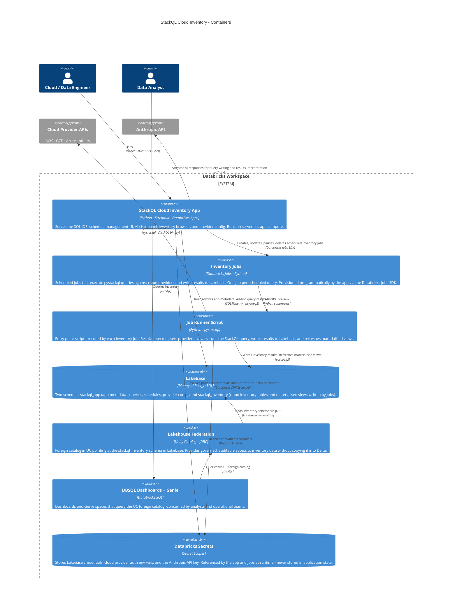
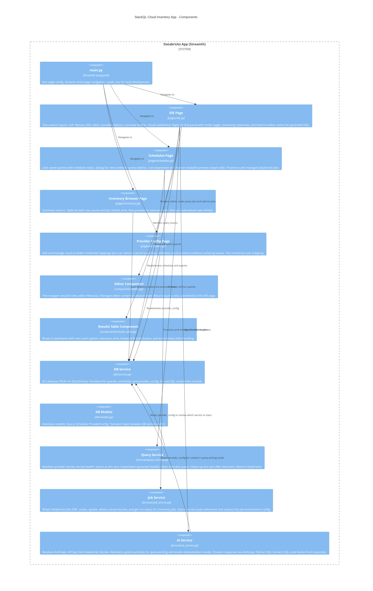
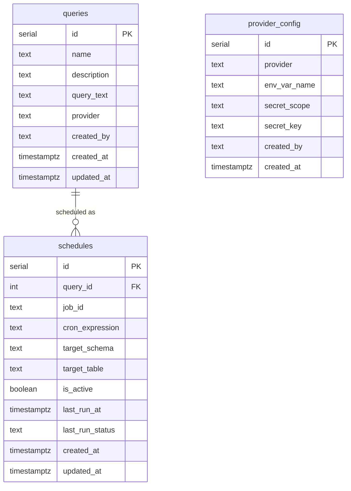
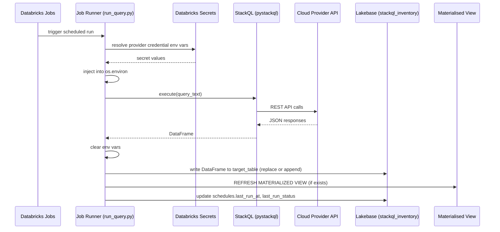
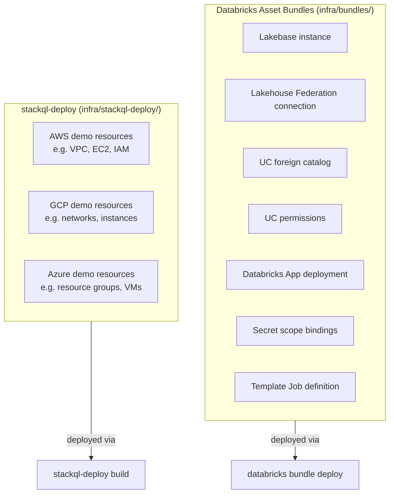

# Architecture - StackQL Cloud Inventory

This document describes the system architecture using the C4 model. Each level progressively zooms in: system context, containers, and then the internal components of the Streamlit app. Annotations explain key design decisions at each level.

---

## C4 Level 1 - System Context

Who uses the system, what external systems it interacts with, and where it sits in the broader landscape.

### Context annotations

**Why Databricks Apps?** The entire platform runs inside a single Databricks workspace. There is no external web server to operate, no separate auth layer to maintain, and no VPN or private link required to reach Lakebase. The Databricks App serverless runtime handles scaling, auth via workspace SSO, and the service principal lifecycle.

**Why StackQL?** StackQL provides a unified SQL interface across cloud provider REST APIs without requiring SDK knowledge or per-provider scripting. The same SELECT syntax works against AWS, GCP, Azure, and any other provider in the registry. Queries are readable, auditable, and version-controllable.

**Why Claude as the AI backend?** The app is built and operated by StackQL Studios. Using the Anthropic API directly (rather than a gateway or a Databricks-hosted model) gives access to the most capable models with streaming support and keeps the dependency surface minimal. The API key is stored in Databricks Secrets and resolved at call time.

---

## C4 Level 2 - Containers

The major deployable units inside the Databricks workspace and how they communicate.

### Container annotations

**Lakebase schema split.** Keeping `stackql_app` (metadata) and `stackql_inventory` (results) in separate Postgres schemas serves two purposes. First, Lakehouse Federation only exposes `stackql_inventory` to UC - app metadata is never surfaced to analysts. Second, if the app is ever rebuilt or redeployed, the inventory data is decoupled from the application state.

**Jobs are provisioned dynamically.** The app does not use a fixed set of pre-defined jobs. When a user schedules a query, the app calls the Databricks Jobs SDK to create a new job, wiring the job runner script with the correct query ID, target table, and secret scope references as environment variables. The Job definition itself does not contain credential values - it references secret scope keys, which Databricks resolves at job runtime. Deleting a schedule deletes the corresponding job.

**No persistent process in the app container.** Streamlit apps on Databricks serverless compute can be stopped between sessions. All durable state lives in Lakebase (metadata) or is managed by Databricks Jobs (scheduling). The app container is stateless.

**Lakehouse Federation over direct DBSQL connection.** Federating Lakebase into UC means inventory data participates in UC governance - column masking, row filters, and access grants work the same as native Delta tables. It also means analysts never need a direct Postgres connection string.

**pystackql binary.** The StackQL binary is downloaded by pystackql on first use to `/tmp/stackql`. In the Databricks App container this path must be writable. If the container restricts execution, the binary can be bundled in the app source. The job runner has the same requirement - test binary execution early in both environments.

---

## C4 Level 3 - Components (Streamlit App)

The internal structure of the Streamlit app and how its parts relate.

### Component annotations

**Session state ownership.** Each page owns its own session state keys with a page-specific prefix (e.g. `ide_editor_content`, `ide_chat_messages`). The `pending_chat_prompt` key is the only cross-component session state - it is written by the results component and the "Explain Query" button, and read by the chat panel on the next render cycle.

**AI chat modes.** The chat panel has two modes selectable via a toggle at the top of the right column. In **Write Query** mode the system prompt contains StackQL syntax guidance and the selected provider context. In **Interpret Results** mode the system prompt orients the assistant as a cloud infrastructure analyst and the user message includes the result set as a markdown table. Switching modes does not clear chat history - the user can mix modes in a single session.

**Secret injection lifecycle.** `query_service.py` resolves secrets, injects them into `os.environ`, runs the StackQL query, and removes them from `os.environ` in a `finally` block regardless of query outcome. Secrets are never stored in Streamlit session state. The same pattern applies in `ai_service.py` for the Anthropic API key - resolve, use, discard.

**Job service does not store credentials.** When `job_service.py` creates a Databricks Job, the job task environment config references secret scope keys using the Databricks `{{secrets/scope/key}}` interpolation syntax. The resolved values are never written to the job definition. This means the Jobs API response does not contain credential values and audit logs do not expose them.

---

## Data model

The `stackql_app` schema in Lakebase stores application metadata. The `stackql_inventory` schema stores cloud inventory results written by scheduled Jobs.

`stackql_inventory` tables are created dynamically by Job runs. Table names are defined by the user at schedule creation time (e.g. `aws_ec2_instances_us_east_1`). Materialised views over these tables are created manually or via the Inventory Browser refresh action.

---

## Scheduled job execution flow

How a single scheduled inventory job runs from trigger to data availability.

---

## Local development capability matrix

| Capability | Works locally | Notes |
|---|---|---|
| Streamlit UI | Yes | Full hot-reload via `streamlit run` or `databricks apps run-local` |
| pystackql query execution | Yes | Binary downloaded to `/tmp/stackql` on first run |
| App metadata (stackql_app schema) | Yes | Local Postgres via Docker substitutes for Lakebase |
| Databricks Secrets API | Yes | Requires `DATABRICKS_HOST` + `DATABRICKS_TOKEN` in `.env` |
| AI chat (Anthropic API) | Yes | Key resolved from workspace secrets or `ANTHROPIC_API_KEY` env var |
| Databricks Jobs SDK | Yes | Creates real jobs in the connected workspace |
| Lakebase (real instance) | No | Local Postgres used as substitute |
| Databricks App SSO / OAuth | No | Auth bypassed locally - no login prompt |
| `DATABRICKS_TOKEN` auto-injection | No | Must be set manually in `.env` |

---

## Infrastructure split

Infrastructure is intentionally split across two tools based on what is being provisioned.

**Asset Bundles** own everything inside the Databricks workspace: the Lakebase instance, federation, UC catalog, the app itself, and the template Job that `job_service.py` clones for each scheduled query.

**stackql-deploy** owns cloud provider resources that the inventory queries will target in demo and test environments. It uses the stateless IaC pattern (tags as natural keys, no state files). These are optional - in production the inventory queries point at real existing infrastructure.
