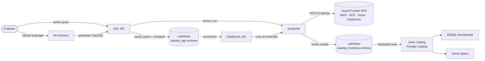

# StackQL Cloud Inventory

A Databricks-native cloud inventory platform built on [StackQL](https://stackql.io). Engineers define SQL queries against cloud provider APIs, schedule them as Databricks Jobs, and surface the results as governed data in Unity Catalog - powering dashboards and Genie spaces without any external infrastructure.

---

## What it does

Cloud teams typically have no single view of their infrastructure across providers. They rely on fragmented scripts, manual exports, or expensive third-party CSPM tools to answer basic questions like "what EC2 instances are running in us-east-1?" or "which GCP service accounts have owner-level bindings?".

StackQL Cloud Inventory solves this by treating cloud provider APIs as SQL tables. Engineers write standard SQL queries using StackQL syntax, test them interactively in a built-in IDE, and schedule them to run on a recurring basis. Results land in a managed Postgres instance (Lakebase) inside the Databricks workspace, federated into Unity Catalog, and immediately available for dashboards, Genie spaces, and ad-hoc DBSQL queries.

The entire platform runs inside a single Databricks workspace. There is no external query engine, no separate database to manage, and no additional infrastructure to operate.

---

## How it is used

A typical workflow looks like this:

1. An engineer opens the app and navigates to **Provider Config** to map cloud provider credentials (AWS, GCP, Azure, Databricks, etc.) to Databricks secret scope keys. Credentials never leave the workspace.

2. The engineer opens the **SQL IDE** and writes a StackQL query - for example, listing all running EC2 instances across regions. They select the relevant provider, hit Run, and see results inline as a dataframe.

3. If the query is useful, they save it to the query library and navigate to **Schedules** to configure it as a recurring Databricks Job. They name the output table, set a cron expression, and the app provisions the Job automatically.

4. The Job runs on schedule, writes results to a Lakebase table in the `stackql_inventory` schema, and refreshes any materialised views over that table.

5. The inventory data is available in Unity Catalog via Lakehouse Federation. Data consumers query it via DBSQL, build dashboards, or use a Genie space to ask natural language questions about their cloud infrastructure.

At any point, the engineer can use the built-in **AI assistant** (powered by Claude) to help write StackQL queries from a plain-English description, explain an existing query, or interpret what the results mean in operational terms.

---

## End-to-end flow



---

## Components

| Component | Technology | Purpose |
|---|---|---|
| Web app | Streamlit (Databricks Apps) | IDE, schedules, inventory browser, provider config |
| SQL IDE | Monaco editor via streamlit-code-editor | Write and test StackQL queries interactively |
| AI assistant | Anthropic Claude API | Query writing help and results interpretation |
| StackQL execution | pystackql | Executes StackQL queries against cloud provider APIs |
| App metadata store | Lakebase (managed Postgres) | Queries, schedules, provider config |
| Inventory store | Lakebase (managed Postgres) | Cloud inventory tables and materialised views |
| Data governance | Unity Catalog (Lakehouse Federation) | Federated catalog over inventory schema |
| Job scheduling | Databricks Jobs | Runs scheduled inventory queries |
| Secret management | Databricks Secrets | Cloud provider credentials and API keys |
| App infra | Databricks Asset Bundles | Lakebase, federation, app deployment, Job template |
| Demo infra | stackql-deploy | Cloud provider resources for demo/test environments |

---

## Supported cloud providers

Any provider available in the [StackQL Provider Registry](https://registry.stackql.io) is supported. Common targets:

- AWS (EC2, IAM, S3, RDS, Lambda, and 60+ other services)
- Google Cloud (Compute, IAM, Storage, BigQuery, and others)
- Azure (Compute, Networking, IAM, and others)
- Databricks (workspaces, clusters, jobs, SQL warehouses)
- GitHub, Cloudflare, Okta, and others

Provider auth is configured per-provider via Databricks secret scope references. The app resolves credentials at query execution time and does not persist them in the application layer.

---

## Dependencies

### Runtime (Databricks workspace)

- Databricks workspace with **Databricks Apps** enabled
- **Lakebase** (managed Postgres) provisioned in the workspace
- **Unity Catalog** enabled with Lakehouse Federation
- Databricks CLI v0.200+ for deployment
- A Databricks secret scope (`stackql-inventory`) containing:
  - Lakebase connection credentials
  - Cloud provider auth credentials (one or more providers)
  - Anthropic API key (for AI assistant)

### Python packages (app runtime)

- `streamlit` - app framework
- `streamlit-code-editor` - Monaco SQL editor component
- `pystackql` - StackQL Python wrapper
- `anthropic` - Claude API client
- `databricks-sdk` - workspace client (Jobs, Secrets)
- `sqlalchemy` + `psycopg2-binary` - Lakebase connection
- `pandas` - query result handling
- `croniter` - cron expression parsing and preview
- `python-dotenv` - local development env loading

### Infrastructure tooling (deployment)

- Databricks CLI with Asset Bundles support
- `stackql-deploy` (for demo/test cloud provider resource provisioning)

### Local development only

- Docker (local Postgres standing in for Lakebase)
- Python 3.11+

---

## Repository structure

```
stackql-cloud-inventory/
|- app/                          <- Databricks App source
|   |- src/
|   |   |- pages/                <- Streamlit pages
|   |   |- components/           <- Reusable UI components
|   |   |- db/                   <- Lakebase models and service
|   |   |- services/             <- StackQL, Jobs, AI service wrappers
|   |   |- main.py
|   |- requirements.txt
|   |- app.yml                   <- Databricks App manifest
|- infra/
|   |- bundles/                  <- Databricks Asset Bundles
|   |   |- databricks.yml
|   |   |- resources/
|   |- stackql-deploy/           <- Demo/test cloud provider resources
|       |- stackql_manifest.yml
|       |- resources/
|- scripts/
|   |- init_lakebase.sql         <- Lakebase schema DDL
|- .vscode/
|   |- launch.json               <- Local run and debug configs
|- .gitignore
|- README.md
|- ARCHITECTURE.md
|- CLAUDE.md
```

---

## Local development

The app can be run locally against a real Databricks workspace (for secrets and Jobs) with a local Postgres instance standing in for Lakebase. See `ARCHITECTURE.md` for the local dev capability matrix and `CLAUDE.md` for setup instructions.

```
databricks apps run-local --prepare-environment --debug
```

or simply:

```
cd app && streamlit run src/main.py
```

---

## Deployment

Infrastructure is deployed in two steps:

**1. Databricks-side resources** via Asset Bundles:

```
cd infra/bundles
databricks bundle deploy --target dev
```

This provisions Lakebase, Lakehouse Federation, the UC foreign catalog, secret scope bindings, the Databricks App, and the template Job definition.

**2. App deployment:**

```
databricks apps deploy stackql-cloud-inventory \
  --source-code-path /Workspace/Users/<you>/...
```

**3. (Optional) Demo cloud provider resources** via stackql-deploy:

```
cd infra/stackql-deploy
stackql-deploy build stackql_manifest.yml --env dev
```

---

## License

MIT
